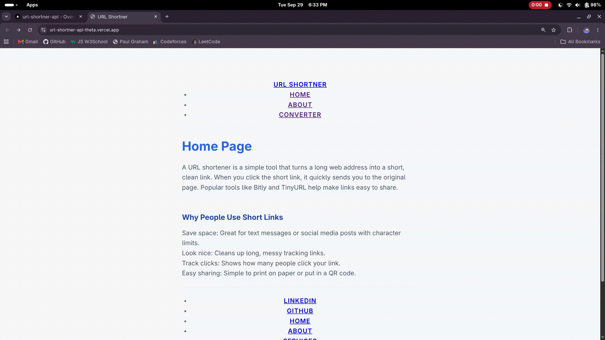

# NotBitly: URL Shortener

A URL shortener inspired by Bitly, built with Node.js and Express. Paste a long URL, get a short link back, and visiting that short link redirects you to the original page.

**Live demo:** https://url-shortner-api-theta.vercel.app/

<!-- TODO: re-record this GIF to show the current web UI. The existing Output.gif shows the old CLI prototype. -->



## Features

- Shorten any URL through a simple web form, with no page reload
- JSON API endpoint that can be used without the UI
- Dynamic redirect route that forwards short links to the original URL
- Random 8-character IDs generated with `nanoid`
- Shared header and footer across pages using Web Components

## Tech Stack

| Layer         | Technology                                                     |
| ------------- | -------------------------------------------------------------- |
| Runtime       | Node.js (ES modules)                                           |
| Server        | Express                                                        |
| ID generation | nanoid                                                         |
| Frontend      | Vanilla HTML, CSS and JavaScript (`fetch` API, Web Components) |
| Hosting       | Vercel                                                         |

## Project Structure

```
.
├── index.js               # Express server: page routes, API, redirect
├── package.json
├── public/                # Static files served by express.static
│   ├── index.html         # Home page
│   ├── about.html         # About page
│   ├── converter.html     # Form + fetch() call to the API
│   ├── global-layout.js   # <main-header> and <main-footer> web components
│   └── style.css
└── Output/                # Demo GIF
```

## Getting Started

**Prerequisites:** Node.js 18 or newer.

```bash
git clone https://github.com/buntai-fries/URL_Shortner_API.git
cd URL_Shortner_API
npm install
node index.js
```

Then open http://localhost:3000.

> **Note:** the short link returned by the API currently uses the deployed Vercel domain as its base (see [Known Limitations](#known-limitations)), so when running locally, click the short link only on the deployed site.

## How It Works

1. On the **Converter** page, the user submits a URL.
2. The browser sends it to `POST /api/conversion` as JSON using `fetch`, and the page never reloads.
3. The server generates an 8-character ID with `nanoid`, stores `ID -> original URL` in an in-memory object, and responds with the short link.
4. The page displays the short link returned by the API. The frontend stores nothing itself.
5. When anyone visits `GET /:shortID`, the server looks the ID up and redirects to the original URL. Unknown IDs get a 404.

## API Reference

### `POST /api/conversion`

Creates a short link for a URL.

**Request body** (`Content-Type: application/json`)

```json
{
  "originalUrl": "https://example.com/a/very/long/path?with=query"
}
```

**Response** `200 OK`

```json
{
  "message": "Conversion Completed.",
  "shortLink": "https://url-shortner-api-theta.vercel.app/V1StGXR8",
  "original": "https://example.com/a/very/long/path?with=query"
}
```

**Try it with curl**

```bash
curl -X POST http://localhost:3000/api/conversion \
  -H "Content-Type: application/json" \
  -d '{"originalUrl": "https://example.com"}'
```

### `GET /:shortID`

Redirects to the original URL.

| Case         | Result                                               |
| ------------ | ---------------------------------------------------- |
| ID exists    | `302` redirect to the original URL                   |
| ID not found | `404` with the message "Error, the link was broken!" |

### Pages

| Route            | Page               |
| ---------------- | ------------------ |
| `GET /`          | Home               |
| `GET /about`     | About              |
| `GET /converter` | URL converter form |

## Design Decisions

- **JSON API instead of form posts.** A traditional form submit reloads the whole page. A dedicated endpoint plus `fetch` lets the UI update in place and makes the API reusable from other clients.
- **Dynamic route registered last.** `GET /:shortID` matches almost any single-segment path, so it is registered after `/about`, `/converter` and the static middleware. Registering it earlier would swallow those routes.
- **Stateless frontend.** The browser holds no data. It renders whatever the API returns, which keeps the server as the single source of truth.
- **`res.redirect` (HTTP 302).** A 302 is temporary and is not cached permanently by browsers, which keeps the door open for adding click tracking later.
- **Web Components for the layout.** `<main-header>` and `<main-footer>` are custom elements defined in one JS file, so the shared navigation and footer live in one place without a build step or template engine.

## What I Learned

- **Serving pages.** Static HTML is served with `res.sendFile`, whereas template engines such as EJS use `res.render`. Static files are sent as-is and need a shared layout solution of their own.
- **Shared layout without a framework.** Web Components (`customElements.define`) let one JS file provide the same header and footer to every HTML page.
- **CSS is a static file, and folder structure matters.** Express only serves what it is told to serve. `express.static("public")` maps files in `public/` to URL paths, so where a file lives decides its URL, and `href="style.css"` only works because of that mapping.
- **Absolute paths in ES modules.** `__dirname` does not exist in ES modules, so I build it from `import.meta.url` using `fileURLToPath` and `path.dirname`.
- **Generating IDs with `nanoid`.** Short, URL-safe random IDs, with the length passed as an argument (`nanoid(8)`).
- **The `fetch` API.** My first time using it: sending JSON to my own endpoint with `POST`, reading the JSON response, and updating the DOM without a reload.
- **Route order matters in Express.** Routes match in registration order, so a catch-all like `/:shortID` must come after the specific routes.

## Known Limitations

- **In-memory storage.** Links are kept in a plain JavaScript object, so they are lost whenever the server restarts. On a serverless host like Vercel, instances can be recycled at any time, so previously created links may stop working.
- **Hard-coded base URL.** The short link is built from the deployed Vercel domain rather than the current host, so links generated locally point at production.
- **No server-side URL validation.** The browser's `type="url"` check is the only validation. The server does not verify that `originalUrl` is present or that it is an `http`/`https` URL.
- **No duplicate handling or collision check.** The same URL gets a new ID each time, and generated IDs are not checked against existing ones (collisions are extremely unlikely at this scale with `nanoid(8)`, but not impossible).
- **Result rendered with `innerHTML`.** The converter page inserts server data into the page as HTML rather than as text.

## Roadmap

- [ ] Persistent storage (database or key-value store) so links survive restarts
- [ ] Build the short link from the request host or an environment variable
- [ ] Validate and normalize URLs on the server, allowing only `http` and `https`
- [ ] Return proper error responses (`400`) for bad input
- [ ] Click counting per short link
- [ ] Copy-to-clipboard button on the result

## License

MIT. See [LICENSE](LICENSE).
